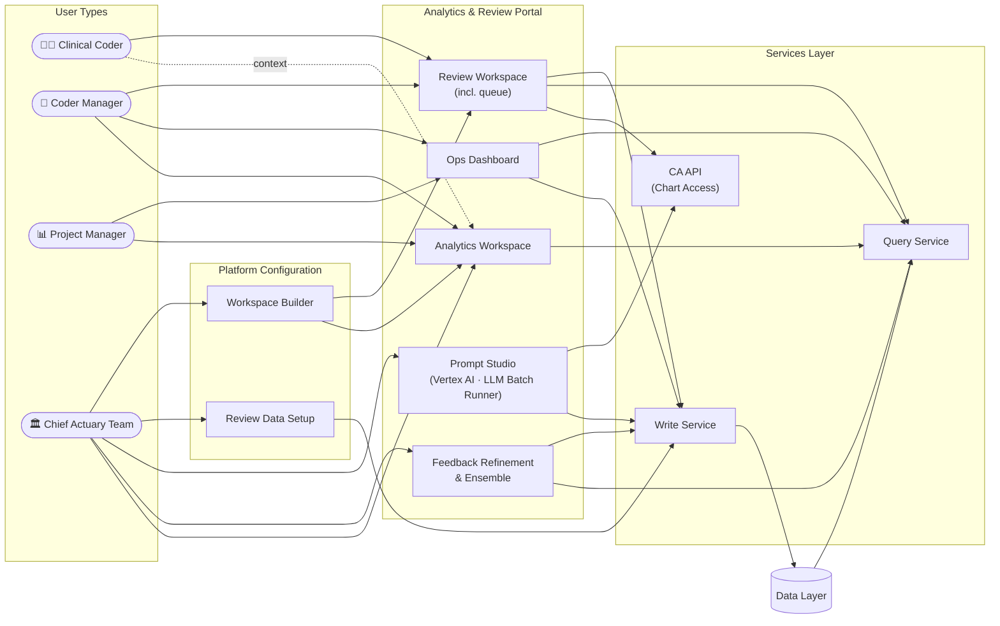
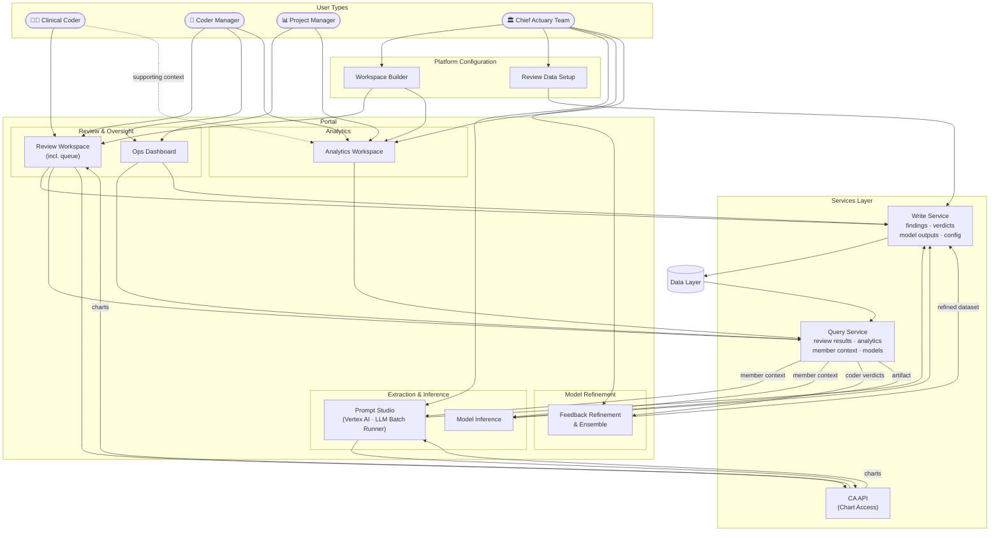
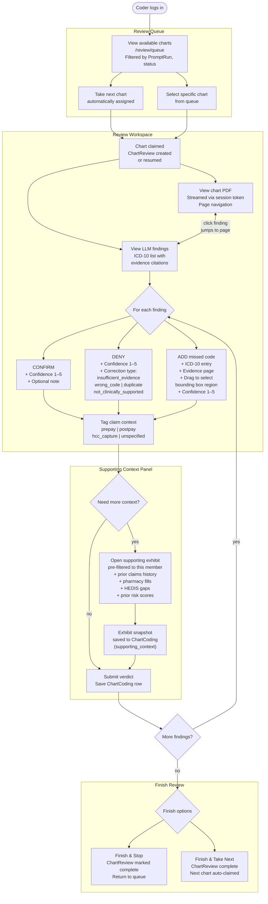
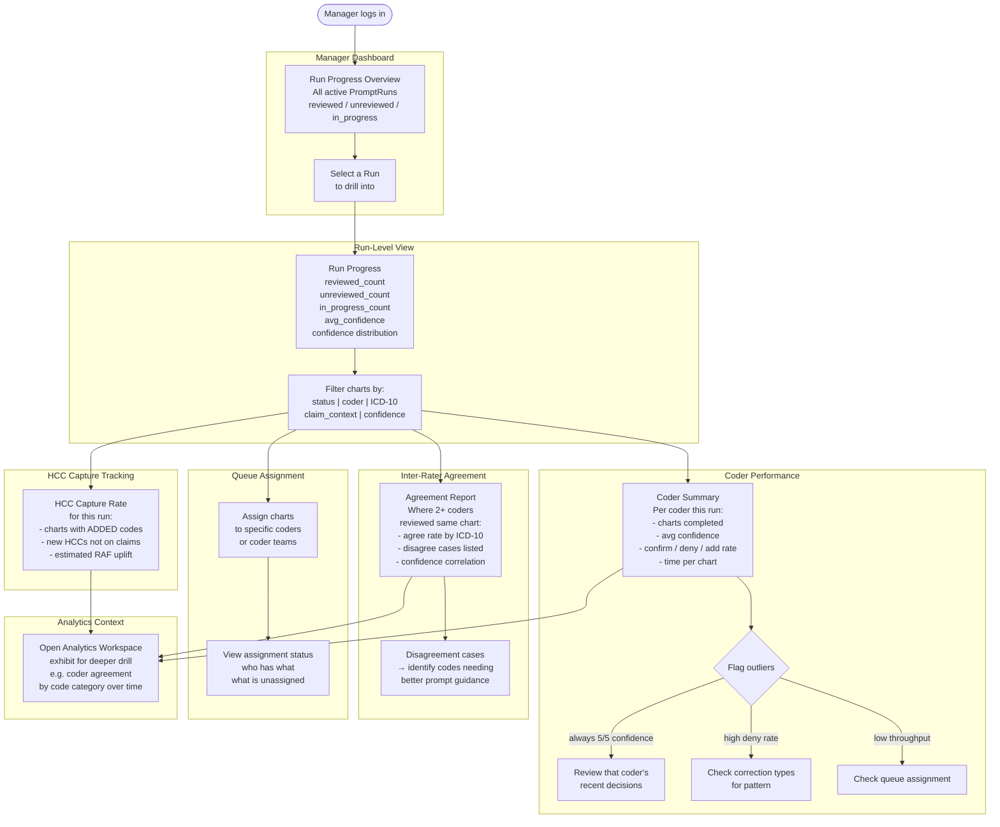
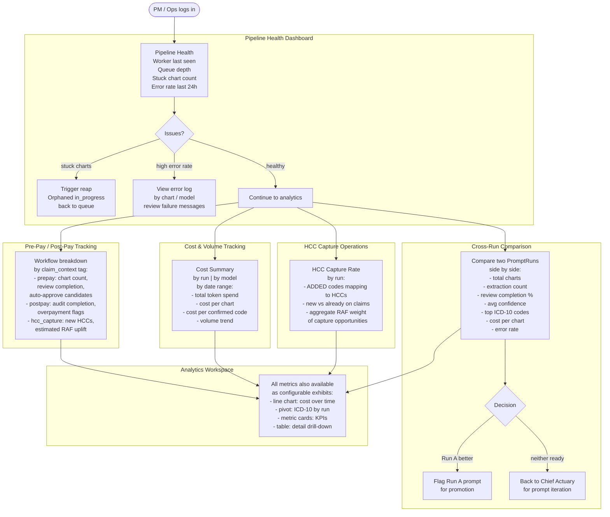
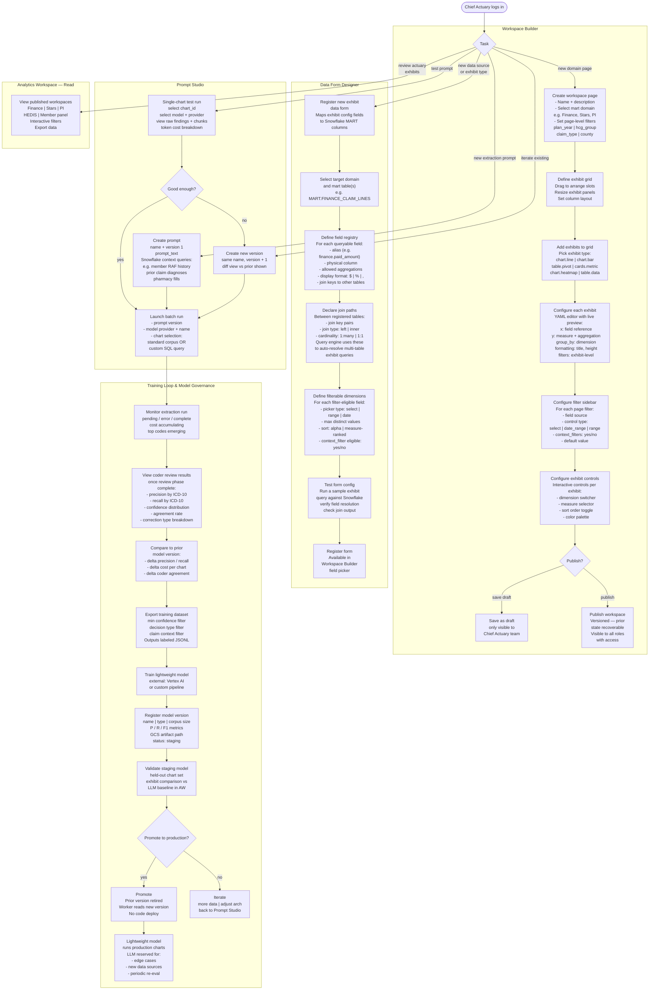
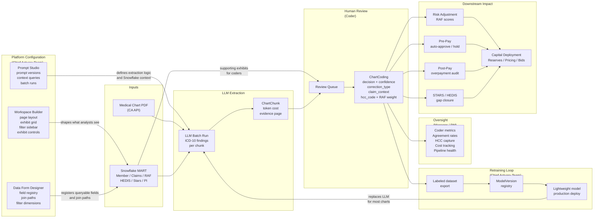

# Platform Interaction Diagram

**User types:** Clinical Coder · Coder Manager · Project Manager · Chief Actuary Team  
**Renders in VS Code Markdown Preview (Ctrl+Shift+V)**

---

## 1a. Platform Overview — Simplified

---

## 1b. Full System — Prediction Loop Included

---

## 2. Clinical Coder — Full Interaction Flow

---

## 3. Coder Manager — Full Interaction Flow

---

## 4. Project Manager / Ops — Full Interaction Flow

---

## 5. Chief Actuary Team — Full Interaction Flow

---

## 6. Data Flow Summary — All Users

