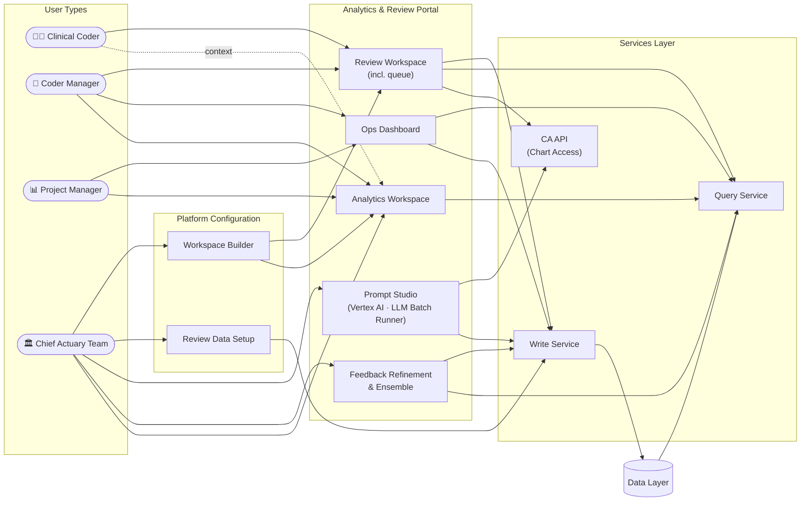
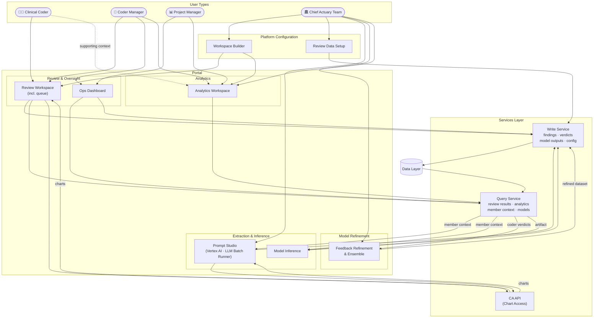

# Platform Interaction Diagram

**User types:** Clinical Coder · Coder Manager · Project Manager · Chief Actuary Team  
**Renders in VS Code Markdown Preview (Ctrl+Shift+V)**

---

## 1a. Platform Overview — Simplified

---

## 1b. Full System — Prediction Loop Included

